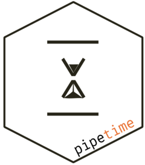

```{r, include = FALSE}
knitr::opts_chunk$set(
  collapse = TRUE,
  comment = "#>"
)
```
# pipetime 

# Introduction

The `pipetime` package lets you measure how long your pipeline (`|>`) operations take. It works with the native R pipe (`|>`) and integrates naturally with **tidy workflows**.

You can use `pipetime()` in two ways:

1.  **Time a single step:** wrap `pipetime()` around a `dplyr` operation in your pipeline. It will show how long that step took.

2.  **Time the whole pipeline:** place `pipetime()` at the end of the pipeline. It will show the total time for all steps up to that point.

You can also print timing messages to the console or save them to a file for later review.

``` {r}
# devtools::install_github("CyGei/pipetime")
library(pipetime)
library(dplyr)
```

# Timing a Single Step

You can time just one part of your pipeline:

```{r}
mtcars |>
  pipetime(mutate(hp2 = hp * 2), "quick mutate") |>
  pipetime(summarise(avg_hp2 = {Sys.sleep(0.3); mean(hp2)}), "complex summary")
```

Here, `quick mutate` and `complex summary` are measured **separately**, each showing its own time.

# Timing the Whole Pipeline

You can also measure the total time for multiple steps by placing `pipetime()` at the end:

```{r}
df <- mtcars |>
  mutate(hp2 = {Sys.sleep(0.2); hp * 2}) |>
  mutate(hp3 = {Sys.sleep(0.2); hp * 3}) |>
  pipetime("total pipeline time")
```

Here, the timing includes **both mutate steps**, giving you the total time for all previous operations.

# Logging to a File

You can record timing logs to a file by specifying the `log_file` argument:

```{r}
# using tempfile() for demonstration
log_file <- tempfile(fileext = ".log")

df1 <- mtcars |>
  mutate(hp2 = {Sys.sleep(0.1); hp * 2}) |> 
  pipetime("df1", log_file = log_file, console = FALSE)

df2 <- mtcars |>
  mutate(hp3 = {Sys.sleep(0.2); hp * 3}) |> 
  pipetime("df2", log_file = log_file,console = FALSE)

# Read the log file
cat(readLines(log_file), sep = "\n")
```

This is useful for **long pipelines** or keeping a record of how long each part took.
